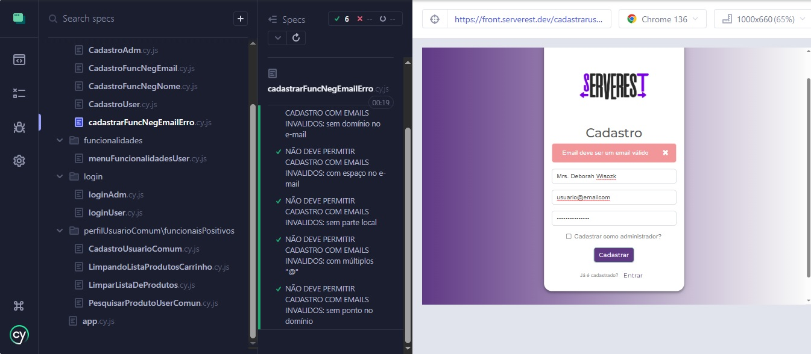

# 🧪 Projeto de Testes Automatizados com Cypress – Serverest

Este repositório apresenta um projeto completo de **testes automatizados end-to-end** utilizando o Cypress e o Postman, focado na validação de fluxos de **cadastro, login e manipulação de produtos** em uma aplicação web (Serverest).

---

## 📸 Execução de testes Cypress



---

## 📌 Visão Geral

- 🔍 Validação completa do **formulário de cadastro** (positivo e negativo)
- 🧪 Cobertura de **cenários reais** de entrada de dados inválidos
- 🧼 Organização modular e escalável de arquivos de teste
- 🚀 Testes executados via **Cypress Test Runner** e **Postman**

---

## 🧠 O que foi testado?

### ✅ Testes Positivos
- Cadastro de usuários comuns e administradores
- Login com credenciais válidas
- Inclusão e visualização de produtos

### ❌ Testes Negativos
- Cadastro com campos obrigatórios em branco
- Cadastro com e-mails malformados:
  - Com espaços
  - Com múltiplos “@”
  - Sem ponto no domínio
- Cadastro com senhas vazias
- Login inválido

---

## 🗂️ Planos de Teste

### 🎨 Frontend (Cypress)
Page de teste frontend em: https://front.serverest.dev/login
- Validação de formulários de cadastro e login
- Simulação de interações do usuário na interface
- Testes com entradas válidas e inválidas
- Validação de mensagens de erro e sucesso
- Validação de formulários de cadastro de produtos

### 🔧 Backend (Postman)
Documentação para testes backend em: https://serverest.dev/
- Testes de API: `POST /usuarios`, `GET /produtos`, `POST /login`
- Testes com dados válidos e inválidos
- Verificação de códigos de status (200, 400, 401, 422)
- Validação de estrutura de respostas JSON

---

## 📁 Estrutura do Projeto

<pre><code>
📦cypress
 ┣ 📂e2e
 ┃ ┣ 📂cadastro             # Testes de cadastro
 ┃ ┃ ┣ cadastrarFuncNegEmailErro.cy.js
 ┃ ┃ ┣ cadastrarFuncNegNome.cy.js
 ┃ ┃ ┣ CadastroUser.cy.js
 ┃ ┃ ┗ CadastroAdm.cy.js
 ┃ ┣ 📂funcionalidades      # Testes de funcionalidades gerais
 ┃ ┣ 📂login                # Login de usuários
 ┃ ┃ ┗ loginUser.cy.js
 ┗ 📜app.cy.js              # Ponto de entrada de testes gerais

📂support
 ┗ 📜commands.js            # Custom commands para reuso

📂fixtures
 ┗ 📜example.json           # Mocks de dados

📜README.md
📜cypress.config.js
📜package.json
</code></pre>

---

## 🧾 Cenários de Testes

Os detalhes completos dos casos de testes utilizados neste projeto (incluindo pré-condições, passos e resultados esperados) podem ser acessados no link abaixo:

🔗 [Documentação de Casos de Teste backend][(https://docs.google.com/spreadsheets/d/1f7C1ZCjv1S-MpulreQ8sKwiPQgG3QhUhZlTKmtBYXWk/edit?usp=sharing)
🔗 [Documentação de Casos de Teste frontend][[(https://docs.google.com/spreadsheets/d/1f7C1ZCjv1S-MpulreQ8sKwiPQgG3QhUhZlTKmtBYXWk/edit?usp=sharing)](https://docs.google.com/spreadsheets/d/1YaS8QGDxzoFfKDqgzkrcxGc5kIQaZvb7Ve8ioHWJU6s/edit?usp=sharing)

---

## 📷 Evidências e 🐞 Bugs Encontrados - Frontend Serverest

📂 Pasta com prints de execução e descrição de bugs encontrados:  
🔗 [Acessar Evidências no Google Drive](https://drive.google.com/drive/folders/1VpLARHrkQL6tS2kx52RK2SdswJzb9xsv?usp=drive_link)


## 📷 Evidências e 🐞 Bugs Encontrados – API Serverest
🔍 Projeto: Testes Automatizados da API Serverest
🛠 Ferramentas: Postman, Node.js, API pública https://serverest.dev
📅 Data da Execução: 10/05/2025
📂 Ambiente: Produção (API pública)
📌 Evidência Principal: Listagem de usuários retorna senha em texto plano + permissões administrativas indevidas

🐞 Descrição do Bug Identificado
ID do Bug: BUG-API-001
Severidade: Alta
Endpoint: GET https://serverest.dev/usuarios
Comportamento Observado:

O endpoint retorna objetos de usuários contendo o campo "password" com valor visível em texto plano.

Um dos usuários listados possui o campo "administrador": "true", mesmo utilizando uma senha comum, não segura ("teste"), o que evidencia um possível problema de controle de acesso ou má definição de privilégios.

📷 Imagem da Evidência (Postman)
Título da Evidência: Bug - Senha comum com privilégio de admin
Prints:(https://drive.google.com/drive/folders/1aXtMeAd5duEDXQQCPN5lIT27NwULccyX?usp=drive_link).


bug_senha_comun_com_privilegio_adm.jpg

Mostra claramente um usuário com:

password: "teste"

administrador: "true"

A resposta HTTP retorna 200 OK, validando que o comportamento é aceito pela API.

🧪 Requisição Utilizada
Método: GET

Endpoint: /usuarios

Cabeçalhos: Nenhum token necessário

Parâmetros: Nenhum

🛡️ Riscos e Impactos
Segurança: Exposição de senhas em texto plano pode comprometer dados de produção.

Acesso indevido: Usuários comuns com privilégios de administrador representam falha crítica de controle de permissões.

Conformidade: Não aderente à LGPD / GDPR (dados sensíveis visíveis publicamente).

---

## ⚙️ Tecnologias Utilizadas

- [Cypress](https://www.cypress.io/) – Framework de testes E2E (Frontend)
- [Postman](https://www.postman.com/) – Testes de API REST (Backend)
- [Faker.js](https://fakerjs.dev/) – Geração de dados dinâmicos
- [Cypress File Upload](https://www.npmjs.com/package/cypress-file-upload) – Upload automatizado de imagens

---

## 🚀 Como Executar os Testes

1. **Clone o projeto:**

```bash
git clone https://github.com/seu-usuario/testes-cypress-serverest.git
cd testes-cypress-serverest
